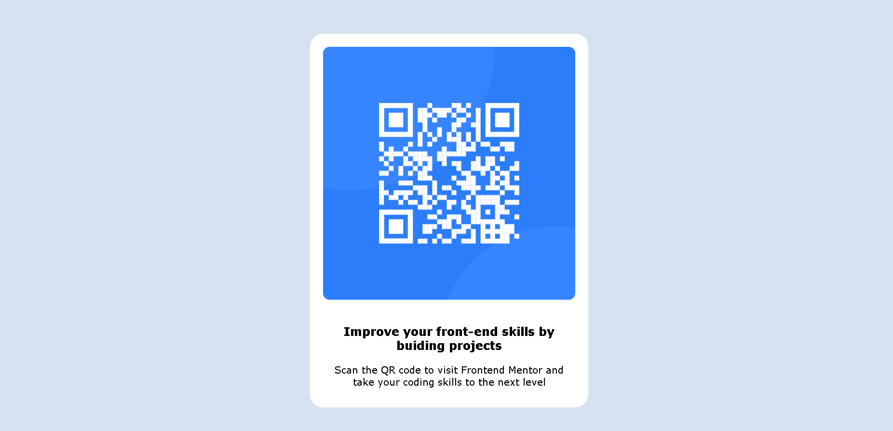

# Table of Contents

## Overview 

 Screenshot



  Link

  - [Adi's Frontend Mentor QR solution is live on Netlify](https://sunny-croissant-d7a787.netlify.app/)

## My Process

 Built with:
  - Semantic HTML 
  - CSS
  - Flexbox
  
What I learned 

-   Used flexbox & **justify-content: center** on the body tag which is inherited by all other nested elements

  ```css
body {
  display: flex;
  justify-content: center;
}
```

  -  < section class = 'card' > is centered on the page by the inherited flexbox center property from the body tag


  -  Note: Commented out border properties class selectors helped me visualize where each block-level element was on the page. In the future, I hope to be able to visualize without such cues.

- I couldn't align the h1 and p text as per the screenshot, and would appreciate any insights on how to fix my code

Continued Development

- My CSS is messy. For example, in the card class, I used margin-top, margin-right, margin-left, margin-bottom, manually rather than the shorthand as I couldn't figure out why it was behaving differently. 
  
- I could have used variables for repetitive code such as background, but I'm still not 100% confident implementing it and hope to integrate it into future solutions.

##  Useful resources 

None used

## Author

- [@bkkcoder](https://www.frontendmentor.io/profile/bkkcoder)
- [Adi](https://twitter.com/aranawrites)

## Acknowledgments

- N/A